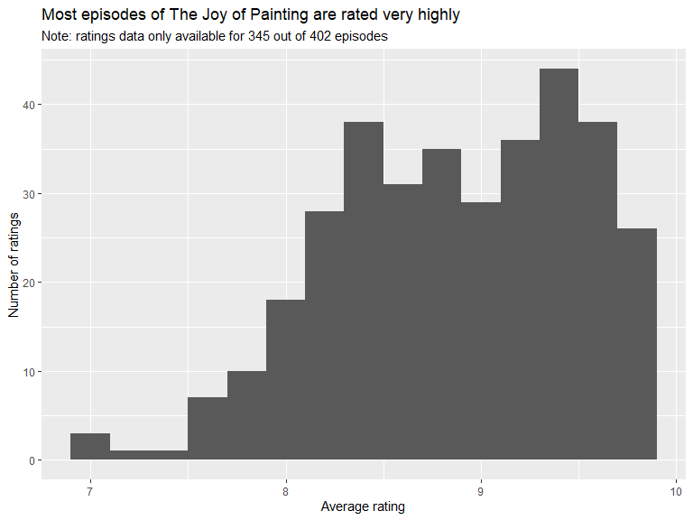
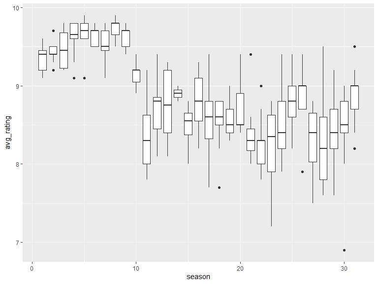
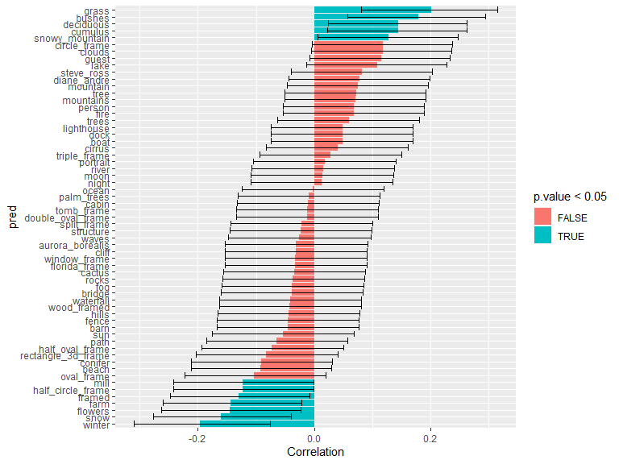
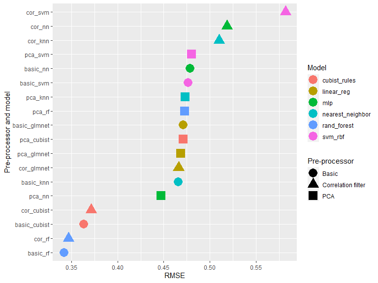

``` r
library(tidyverse)
library(janitor)
library(tidymodels)
```

<br />

### load, tidy, and join, Bob Ross episodes features dataset and IMDb episode rankings

``` r
bob_ross <- read_csv("https://raw.githubusercontent.com/rfordatascience/tidytuesday/master/data/2019/2019-08-06/bob-ross.csv")

bob_ross <- bob_ross %>%
    clean_names() %>%
    separate(episode, c("season", "episode"), "E") %>%
    mutate(season = str_remove(season, "S")) %>%
    mutate(season = parse_integer(season)) %>%
    mutate(episode = parse_integer(episode)) %>%
    mutate(title = str_remove_all(title, '\\"')) %>%
    mutate(title = str_to_title(title))

ratings <- read_csv("ratings.csv")

bob_ross <- bob_ross %>%
    inner_join(ratings %>% select(-title), by = c("season", "episode")) %>%
    relocate(all_of(c("year", "total_votes", "avg_rating")), .after = "title")
```

<br />

### How were The Joy of Painting episodes ranked?

``` r
bob_ross %>%
    ggplot(aes(avg_rating)) +
    geom_histogram(binwidth = .2) +
    labs(x = "Average rating",
         y = "Number of ratings",
         title = "Most episodes of The Joy of Painting are rated very highly",
         subtitle = "Note: ratings data only available for 345 out of 402 episodes")
```



Because I’ll be doing some machine learning, I am going to split the
data into training and test sets.

``` r
set.seed(2021)
split <- initial_split(bob_ross)

train <- training(split)
test <- testing(split)
```

<br />

### Which seasons have the highest ratings?

``` r
train %>%
    ggplot(aes(season, avg_rating, group = season)) +
    geom_boxplot()
```



<br />

### Which features are related to episode rating?

``` r
train %>%
    select(avg_rating:wood_framed) %>%
    map_df(~ cor.test(.x, train$avg_rating) %>% tidy(), .id = "pred") %>%
    filter(pred != "avg_rating") %>%
    drop_na(estimate) %>%
    mutate(pred = fct_reorder(pred, estimate)) %>%
    ggplot(aes(estimate, pred, fill = p.value < 0.05)) +
    geom_col() +
    geom_errorbar(aes(xmin = conf.low, xmax = conf.high)) +
  labs(x = "Correlation")
```



<br />

### Split training data using 10 fold cross validation

``` r
set.seed(12345)
folds <- vfold_cv(train)
folds
```

    ## #  10-fold cross-validation 
    ## # A tibble: 10 x 2
    ##    splits           id    
    ##    <list>           <chr> 
    ##  1 <split [232/26]> Fold01
    ##  2 <split [232/26]> Fold02
    ##  3 <split [232/26]> Fold03
    ##  4 <split [232/26]> Fold04
    ##  5 <split [232/26]> Fold05
    ##  6 <split [232/26]> Fold06
    ##  7 <split [232/26]> Fold07
    ##  8 <split [232/26]> Fold08
    ##  9 <split [233/25]> Fold09
    ## 10 <split [233/25]> Fold10

<br />

### What is a baseline error rate?

This method just computes the rmse in the training data using the mean
rating as the prediction for each episode

``` r
rmse_vec(train$avg_rating, rep(mean(train$avg_rating), length(train$avg_rating)))
```

    ## [1] 0.6195622

This method does the same thing, but use the mean of each analysis set
on the corresponding assessment set in the 10 fold cross validation.
This is probably a better estimate of baseline error

``` r
baseline_mean_model <- function(cv_split){
    cv_mean <- cv_split %>% 
        analysis() %>% 
        summarize(mean(avg_rating)) %>% 
        as.numeric()
    
    cv_split %>% 
        assessment() %>%
        rmse(avg_rating, rep(cv_mean, n())) %>%
        select(.estimate) %>%
        as.numeric()
}

map_dbl(folds$splits, baseline_mean_model) %>% mean()
```

    ## [1] 0.6173671

If we guessed the average rating for every episode in the training set,
our RMSE would be about 0.62. I’ll see if I can use some modelling to
beat this baseline

<br />

### Generate several prepocessors

1.  Near zero variance filter only
2.  Centering and scaling of predictors (normalizing) with PCA feature
    extraction
3.  Near zero variance filter, normalizing, and correlation filter

``` r
base_rec <- train %>%
    recipe(avg_rating ~ .) %>%
    update_role(title, new_role = "id") %>%
    step_nzv(all_predictors())

pca_rec <- base_rec %>%
    step_normalize(all_predictors()) %>%
    step_pca(all_predictors(), num_comp = tune())

cor_rec <- base_rec %>%
    step_normalize(all_predictors()) %>%
    step_corr(all_predictors(), threshold = tune())
```

<br />

### Create several model specifications

1.  Cubist
2.  Linear regression
3.  Neural network
4.  KNN
5.  Random forest
6.  SVM

``` r
cubist_spec <- rules::cubist_rules(committees = tune(), neighbors = tune(), max_rules = tune()) %>%
  set_engine("Cubist")

glmnet_spec <- linear_reg(penalty = tune(), mixture = tune()) %>%
  set_engine("glmnet")

nn_spec <- mlp(hidden_units = tune(), penalty = tune(), epochs = tune()) %>%
  set_engine("nnet") %>%
  set_mode("regression")

knn_spec <- nearest_neighbor(neighbors = tune(), weight_func = tune(), dist_power = tune()) %>%
  set_engine("kknn") %>%
  set_mode("regression")

rf_spec <- rand_forest(mtry = tune(), min_n = tune()) %>%
  set_engine("ranger") %>%
  set_mode("regression")

svm_spec <- svm_rbf(cost = tune(), rbf_sigma = tune(), margin = tune()) %>%
  set_engine("kernlab") %>%
  set_mode("regression")
```

<br />

### Generate a workflow set

``` r
wf_set <- workflow_set(
    preproc = list(basic = base_rec, pca = pca_rec, cor = cor_rec),
    models = list(cubist = cubist_spec, glmnet = glmnet_spec, nn = nn_spec, 
                  knn = knn_spec, rf = rf_spec, svm = svm_spec),
    cross = TRUE
   )
```

<br />

### Fit models using ANOVA racing method

``` r
#two models  need to have parameters upgraded
updated_params_pca_rf <- pull_workflow(wf_set, "pca_rf") %>% 
  dials::parameters() %>%
  update(mtry = mtry(c(1, 20)))

updated_params_cor_rf <- pull_workflow(wf_set, "cor_rf") %>% 
  dials::parameters() %>%
  update(mtry = mtry(c(1, 20)))

set.seed(123)
results <- wf_set %>% 
    option_add(param_info = updated_params_pca_rf, id = "pca_rf") %>%
    option_add(param_info = updated_params_cor_rf, id = "cor_rf") %>%
    workflow_map("tune_race_anova", resamples = folds, grid = 25, 
                 metrics = metric_set(rmse), verbose = TRUE)
```

<br />

### Plot results of model training

``` r
rank_results(results, 
             rank_metric = "rmse", 
             select_best = TRUE) %>%
  mutate(pre_proc = case_when(
    str_starts(wflow_id, "basic_") ~ "Basic",
    str_starts(wflow_id, "cor_") ~ "Correlation filter",
    str_starts(wflow_id, "pca_") ~ "PCA"
  )) %>%
  mutate(wflow_id = fct_reorder(wflow_id, mean)) %>%
  ggplot(aes(mean, wflow_id, color = model, shape = pre_proc)) +
  geom_point(size = 6) +
  labs(x = "RMSE",
       y = "Pre-processor and model",
       color = "Model",
       shape = "Pre-processor")
```



<br  >

### Test final model on testing set

``` r
best_params <- pull_workflow_set_result(results, "basic_rf") %>%
    select_best(metric = "rmse")

pull_workflow(results, "basic_rf") %>%
    finalize_workflow(best_params) %>%
    last_fit(split) %>%
    collect_metrics()
```

    ## # A tibble: 2 x 4
    ##   .metric .estimator .estimate .config             
    ##   <chr>   <chr>          <dbl> <chr>               
    ## 1 rmse    standard       0.433 Preprocessor1_Model1
    ## 2 rsq     standard       0.560 Preprocessor1_Model1

<br /> <br /> <br /> <br /> <br />
